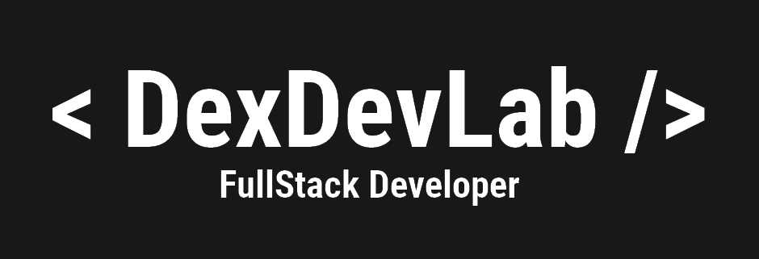

<link href="styles.css" rel="stylesheet"></link>
<body>
<!-- Banner -->

<!-- Dev Icons Session -->

<!-- Reference Hyperlink -->
   <a href="https://code.visualstudio.com/">
<!-- Dev Icon and Alt -->
      
   </a>

   

   
   
   

   

  

   

   

   

   

   

   

   
   
   

<!-- GitHub Widgets -->

  
  
  

  <h3>Trabalhando em:</h3>
  <a href="https://github.com/dexdevlab/dcl-auth-api">
    
    </img>
  </a>

  

<!-- Vercel Trophies -->

<!-- 

  
</a>

 -->

<h2>About me</h2>

<!-- Social Media Links -->

  
  

<!-- Footer -->

<!-- 

<h4>DexDevLab</h4>
<h4>v2.0.3.220127</h4>

 -->

</body>

<!--  -->
